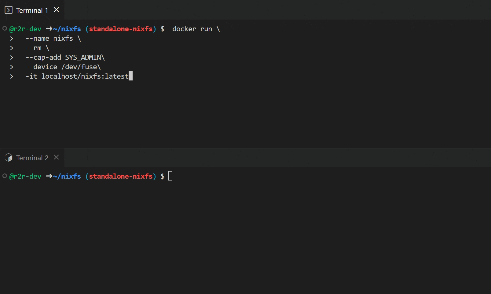

# nixfs - lazy /nix/store based on FUSE


## Quickstart
1. Build image with:
```
docker build . --tag localhost/nixfs:latest
```

2. Create a new container:
```
# [Host] Terminal 1
$ docker run \
  --name nixfs \
  --rm \
  --cap-add SYS_ADMIN\
  --device /dev/fuse\
  -it localhost/nixfs:latest
```

3. In a second terminal window, exec into a running container
```
# [Host] Terminal 2 

$ docker exec -it nixfs bash
```

4. Inspect `/nix/store` in container:
```
# [nixfs container] Terminal 2

# ls -alh /nix/store
total 8.0K
drwxrwxrwt 1 root root 4.0K Dec 16 11:09 .
drwxr-xr-x 1 root root 4.0K Dec 16 11:10 ..
```

5. Try accessing some arbitrary store path:
```
# [nixfs container] Terminal 2

# /nix/store/6l8wkm667h69iry5q9z4j9xy9fd5v0dw-htop-3.2.1/bin/htop
```
6. Switch to terminal 1 and observe how store path and all of its dependencies are fetched lazily.
8. Once again inspect `/nix/store` in container:
```
# [nixfs container] Terminal 2

# ls -alh /nix/store
total 0
drwxr-xr-x 1 root root  12K Dec 16 11:30 .
drwxr-xr-x 1 root root 4.0K Dec 16 11:15 ..
drwxr-xr-x 2 root root 4.0K Dec 16 11:15 .links
dr-xr-xr-x 4 root root 4.0K Jan  1  1970 0gi11bgivf54kbxmns7cw53jjv05n541-readline-8.1p2
dr-xr-xr-x 4 root root 4.0K Jan  1  1970 0lsabvbq5znilmcrk4xl5jk7rs4mv4c8-kmod-30
dr-xr-xr-x 6 root root 4.0K Jan  1  1970 0xxjx37fcy2nl3yz6igmv4mag2a7giq6-glibc-2.33-123
dr-xr-xr-x 3 root root 4.0K Jan  1  1970 2infxahfp9lj084xn3q9ib5ajks8447i-libffi-3.4.4
dr-xr-xr-x 3 root root 4.0K Jan  1  1970 2wx8nddjhlck6n7krf7y40nxia7lklsp-getent-glibc-2.35-224
dr-xr-xr-x 4 root root 4.0K Jan  1  1970 394228vynnwhqw4mymfly4m25akk44xx-libnftnl-1.2.4
dr-xr-xr-x 5 root root 4.0K Jan  1  1970 3nxvwpxmvv5sv2bb88plhs4ys1jl0bmm-attr-2.5.1
dr-xr-xr-x 5 root root 4.0K Jan  1  1970 3xm08j9yrcj91saxq4s3ndl2gc2n717v-libkrb5-1.20
dr-xr-xr-x 3 root root 4.0K Jan  1  1970 4iaf0knbgyz055h509cp039l0g54hdbi-unbound-1.17.0-lib
dr-xr-xr-x 3 root root 4.0K Jan  1  1970 4n2j62ghfgsk5amycf3zss01b3wp0846-gmp-with-cxx-6.2.1
dr-xr-xr-x 3 root root 4.0K Jan  1  1970 4pc2pfmj8nvh5f5pmb59chapvnq0scsw-json-c-0.16
dr-xr-xr-x 7 root root 4.0K Jan  1  1970 4rjdf8497vyny2p4g8nn8vvfacymnpbx-kbd-2.5.1
dr-xr-xr-x 4 root root 4.0K Jan  1  1970 4xw8n979xpivdc46a9ndcvyhwgif00hz-bash-5.1-p16
...
```
